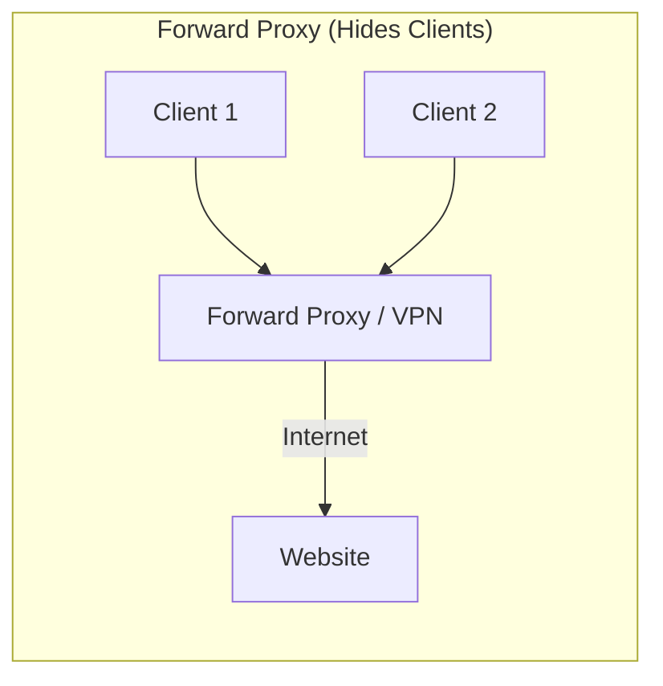
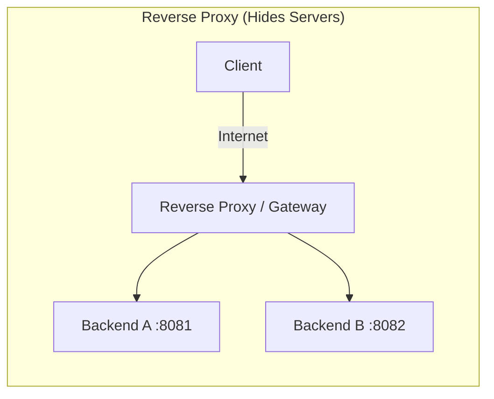

# Interview Deep Dive: What is a Reverse Proxy?

**Interviewer:** *"I see you built a Concurrent HTTP Reverse Proxy in Go. Can you explain what a reverse proxy is, how it differs from a regular (forward) proxy, and why we even need one in a modern backend system?"*

---

## 🗣️ The Perfect "Senior Engineer" Answer Structure

Jab interviewer yeh soche, tumhara answer 3 parts me divided hona chahiye:
1. **The Analogy / High-Level Concept**
2. **Technical Difference (Forward vs Reverse)**
3. **The 'Why' (Benefits in Production)**

### Part 1: The High-Level Concept & Technical Difference

**Aapka Jawab:**
*"Sir, simply put, a proxy is a middleman. But the direction of traffic defines its type.* 

*A **Forward Proxy** sits in front of clients (like a corporate firewall or a VPN). Its job is to protect the **clients** and hide their identities from the internet. When I connect to a website via VPN, the website thinks the VPN is the client. It masks the origin.*

*A **Reverse Proxy**, on the other hand, sits in front of **backend servers**. Its job is to protect the **servers** and hide their identities from the clients. When a user sends a request to our Gateway, they think the Gateway is the actual server generating the response. The client has no idea that behind the proxy, there are 10 different backend microservices actually doing the work."*

### 📊 Diagram to Explain on Whiteboard





---

### Part 2: The "Why" (Production Benefits)

**Interviewer:** *"Okay, I get the difference. But why add this extra hop? Doesn't it add network latency? Why not let clients hit the backend directly?"*

**Aapka Jawab:**
*"Yes, it adds a fractional network hop latency (usually sub-millisecond if they are in the same VPC), but the architectural benefits vastly outweigh that cost. I use a Reverse Proxy for 4 critical reasons:"*

1. **Security & Abstraction (Topology Hiding):** 
   *"Clients should never know the internal IP addresses or the port numbers of our backend servers. If a backend node crashes or is replaced, the internal IP changes. The reverse proxy provides a single, static public entry point (like `api.company.com`)."*
   
2. **Load Balancing & Scaling:** 
   *"A single server can only handle so many connections. A reverse proxy allows us to scale horizontally. In my project, the proxy acts as a load balancer, distributing traffic across multiple backends using atomic round-robin to ensure no single node is overwhelmed."*
   
3. **SSL/TLS Termination:**
   *"Handling encryption/decryption is CPU-intensive. Instead of making every backend microservice handle HTTPS certificates, we terminate the SSL connection at the Reverse Proxy. The proxy talks HTTPS with the client, but plain HTTP with the backend servers inside our secure private network. This saves massive CPU cycles on the backends."*
   
4. **Connection Management & Throttling:**
   *"Clients can have slow networks (like mobile devices). If they connect directly to our backend, they hold the TCP socket open for a long time, exhausting backend resources. A reverse proxy absorbs these slow connections, buffers the request, and then fires it rapidly to the backend over a fast internal network."*

---

### Part 3: Deep Dive into Go Implementation

**Interviewer:** *"Interesting. So how exactly did you implement this Reverse Proxy in Go? Did you just read the request and make an `http.Get` call to the backend?"*

*(This is a trap question! Doing `http.Get` manually is highly inefficient).*

**Aapka Jawab:**
*"No, manually copying headers and writing `http.Get` is inefficient and prone to memory leaks. I leveraged Go's standard library `net/http/httputil` package, specifically `httputil.NewSingleHostReverseProxy`."*

*"Here is how the anatomy of my proxy works:"*

```go
// 1. URL Parse: Define kahan bhejna hai
targetURL, _ := url.Parse("http://127.0.0.1:8081")

// 2. Proxy Creation: Go ka inbuilt engine
proxy := httputil.NewSingleHostReverseProxy(targetURL)

// 3. Custom Error Handler (For Passive Failure Detection)
proxy.ErrorHandler = func(w http.ResponseWriter, r *http.Request, err error) {
    // Agar target server ne TCP connection refuse kar diya:
    log.Printf("Backend failed: %v", err)
    
    // Mark server as dead in our custom logic
    backend.SetAlive(false) 
    
    // Return 502 to client instead of dropping connection
    w.WriteHeader(http.StatusBadGateway)
    w.Write([]byte("502 Bad Gateway"))
}
```

**Interviewer:** *"What exactly is `httputil.ReverseProxy` doing under the hood that makes it better than `http.Get`?"*

**Aapka Jawab:**
*"Under the hood, it does several critical things for performance:"*
1. **Streaming via `io.CopyBuffer`:** *"It doesn't load the entire response body into RAM. It streams the bytes directly from the backend socket to the client socket. This means my proxy can transfer a 2GB video file while only using a few kilobytes of RAM."*
2. **Connection Pooling:** *"It uses Go's `http.Transport` which maintains a pool of persistent Keep-Alive TCP connections to the backends. It reuses sockets instead of performing a 3-way TCP handshake for every single request."*
3. **Header Sanitization:** *"It automatically removes hop-by-hop headers (like `Connection`, `Keep-Alive`, `Te`) which shouldn't be forwarded, and injects context headers like `X-Forwarded-For` so the backend knows the original client's IP."*

---

### 🔥 Summary (Mental Model for Interview)

Jab bhi Reverse Proxy word sune, apne dimaag me yeh 4 keywords laao:
1. **Shield** (Hides internal servers).
2. **Distributor** (Load balancing).
3. **Offloader** (SSL termination & connection pooling).
4. **Streamer** (Uses chunked transfer, doesn't load huge files in RAM).

Agar tumne exactly aese jawab diya, toh interviewer turant samajh jayega ki tumne sirf code copy-paste nahi kiya, balki system design ke core principles ko deeply samajh kar code likha hai!
