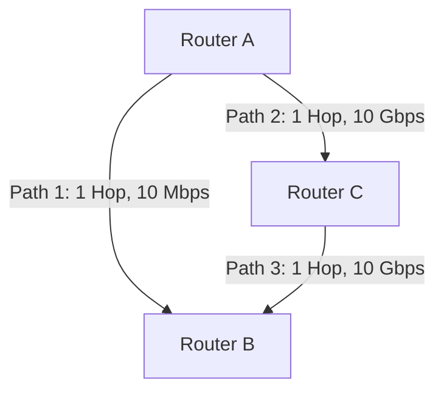

# Episode 1: Routing Protocols - The GPS of the Internet

## 📖 The Story: The Waze App vs The Printed Map
Imagine you're driving from New York to LA. 
- **Static Routing** is a printed paper map. The route never changes. If a bridge collapses in Ohio, you drive off the bridge. You need a human (network admin) to print a new map.
- **Dynamic Routing** is like the **Waze App**. It constantly talks to other drivers on the road. If there's a traffic jam in Ohio, Waze instantly recalculates your route through Kentucky.

## 🤿 Layer 1 Deep Dive: How It Actually Works
Routers don't have eyes; they have a **Routing Table**. When a packet arrives, the router looks at the Destination IP and checks its table for the best exit interface.

But what if a router learns about the *same* destination from two different protocols? How does it choose?
**Enter Administrative Distance (AD):** AD is the "Believability" or "Trustworthiness" of a route. The lower the AD, the more trusted it is.
- Connected Interface: AD 0
- Static Route: AD 1 (Highly trusted because a human typed it)
- OSPF: AD 110
- RIP: AD 120

### Visualizing Routing Logic

* **RIP (Distance Vector):** Chooses Path 1. Why? It only counts hops. 1 hop is better than 2 hops. It ignores the terrible 10 Mbps speed.
* **OSPF (Link-State):** Chooses Path 2 -> Path 3. Why? It uses bandwidth to calculate a "Cost". The 10 Gbps path has a mathematically lower cost than the 10 Mbps path. 

## 🤿 Layer 2 Deep Dive: The Protocols
1. **RIPv2**: Sends its *entire routing table* out of all active interfaces every 30 seconds. Inefficient. Max hops = 15. If a destination is 16 hops away, it's considered dead.
2. **OSPF**: Uses the **Dijkstra Shortest Path First (SPF)** algorithm. Routers form "adjacencies" (neighbor relationships) and exchange LSAs (Link State Advertisements). Every router builds an identical topological database of the entire network. Extremely fast convergence.
3. **BGP**: The protocol of the Internet. It doesn't route between single routers; it routes between **Autonomous Systems (AS)**—massive ISP networks. It uses **Path Attributes** (like AS-Path, Local Preference, MED) to make decisions based on business policies (e.g., "Route traffic through Comcast, not AT&T, because it's cheaper").

## 🎙️ The Interview Answer (Memorize This)
**Interviewer:** *"Compare Static vs Dynamic routing, and explain when you'd use OSPF vs BGP."*
**You:** *"Static routing is manually configured, offering high security and zero CPU overhead, but it lacks fault tolerance. Dynamic routing protocols automatically adapt to topology changes. I would use OSPF for our internal corporate network—it's an Interior Gateway Protocol that calculates the fastest path based on bandwidth cost. I would use BGP to connect our edge routers to ISPs, as it's an Exterior Gateway Protocol that routes based on path attributes and organizational policies."*

## 🕵️ The Interrogation (Read, Answer, Analyze)

**Q1: You configure a Static Route to 10.0.0.0/24. The router also learns a route to 10.0.0.0/24 via OSPF. Which route is placed in the routing table?**
- **Analysis/Answer:** The Static Route. Why? Administrative Distance (AD). A static route has an AD of 1, whereas OSPF has an AD of 110. The router always trusts the route with the lower AD.

**Q2: An OSPF neighbor relationship is stuck in the "INIT" state. What does this mean?**
- **Analysis/Answer:** "INIT" means Router A has received a Hello packet from Router B, but Router B hasn't seen Router A's Hello yet. This is usually a one-way communication issue—often caused by an ACL (Access Control List) blocking OSPF multicast traffic (224.0.0.5) in one direction, or a Layer 2 switching issue.

**Q3: Why doesn't the Internet use OSPF instead of BGP? OSPF is faster.**
- **Analysis/Answer:** OSPF requires every router to hold a complete map of the network in its RAM (Topological Database) and recalculate the SPF algorithm on any change. The internet has nearly 1 million routes; OSPF would crash the router's CPU and RAM. BGP is designed for scale and policy-based routing, not raw speed.
