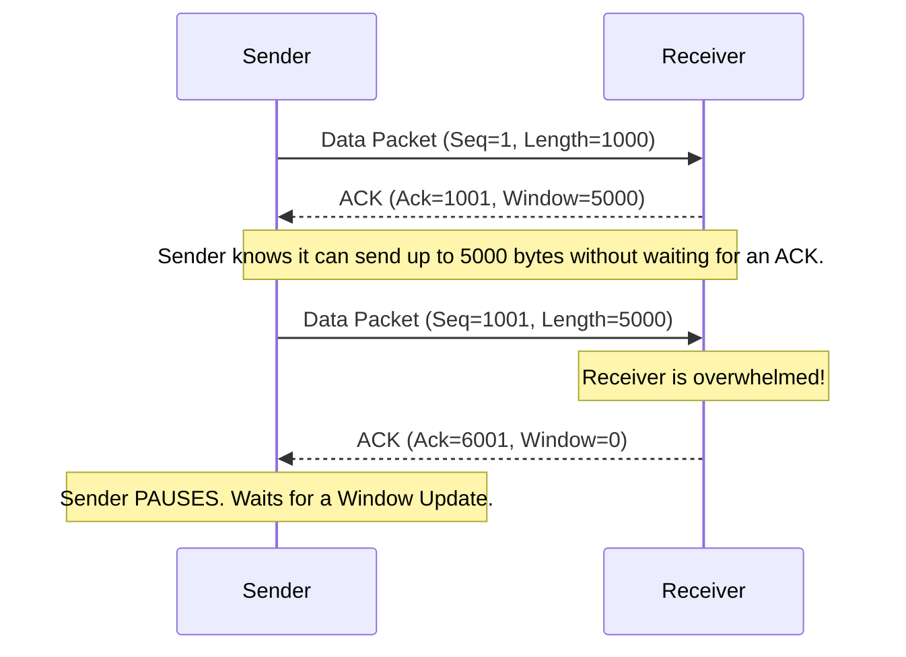

# Episode 2: TCP Congestion Control vs Flow Control

## 📖 The Story: The Firehose and The Traffic Jam
Imagine you are filling a small bucket from a massive firehose.
- **Flow Control** is you yelling at the fireman: *"Hey! My bucket is getting full, slow down the water so it doesn't spill over!"* (Protecting the **Receiver**).
- **Congestion Control** is the fireman noticing that the street is flooded, cars are hydroplaning, and water is backing up in the pipes. He slows down the water to protect the **City Infrastructure** (Protecting the **Network**).

## 🤿 Layer 1 Deep Dive: Flow Control (Sliding Window)
Flow control happens exclusively between the Sender and the Receiver. It uses the **TCP Sliding Window**.
- When the Receiver sends an ACK (Acknowledgement) back to the Sender, it includes its **Window Size** (e.g., "I have 64KB of buffer space left").
- The Sender is not allowed to send more unacknowledged data than the Window Size allows. 
- If the Receiver's CPU gets overwhelmed and its buffer fills up, it sends a Window Size of 0 (`Zero Window`). The Sender completely pauses transmission until the Receiver says, "Okay, I have room now."

### Visualizing Flow Control

## 🤿 Layer 2 Deep Dive: Congestion Control (Slow Start & AIMD)
Congestion control protects the *routers and links* between the sender and receiver. The sender maintains a hidden variable called the **Congestion Window (cwnd)**. 
Total data sent = `min(Receiver Window, Congestion Window)`.

1. **Slow Start:** When a TCP connection starts, it doesn't blast data at 1 Gbps. It starts with a window of 1 packet, then 2, then 4, then 8 (exponential growth) until it hits a threshold (`ssthresh`) or a packet is dropped.
2. **AIMD (Additive Increase, Multiplicative Decrease):** Once it hits the threshold, it grows slowly (adds 1 packet per RTT - Additive Increase). If a packet drops (congestion detected!), TCP slashes its transmission rate *in half* (Multiplicative Decrease).
3. **Fast Retransmit:** If a sender receives 3 duplicate ACKs, it assumes a packet was lost in transit and instantly retransmits it without waiting for a timeout timer to expire.

## 🎙️ The Interview Answer (Memorize This)
**Interviewer:** *"What is the difference between TCP Flow Control and Congestion Control?"*
**You:** *"Flow control protects the receiver. It uses the TCP Sliding Window mechanism to ensure the sender doesn't overwhelm the receiver's buffer capacity. Congestion control protects the network infrastructure. It uses algorithms like Slow Start and AIMD to back off transmission rates when packet loss occurs, preventing network routers from dropping traffic due to congested queues."*

## 🕵️ The Interrogation (Read, Answer, Analyze)

**Q1: You are downloading a file. The network has 10 Gbps capacity, and your PC has a 1 Gbps NIC. However, the download is stuck at 500 Kbps. A packet capture shows the server repeatedly sending "TCP Zero Window" messages. Is this a network congestion issue?**
- **Analysis/Answer:** No. A "Zero Window" message means *Flow Control* is kicking in. The server's application (maybe the disk IO or CPU) is overwhelmed and cannot process incoming data fast enough. The network is fine; the server is the bottleneck.

**Q2: What triggers TCP Fast Retransmit, and why is it 'fast'?**
- **Analysis/Answer:** Fast Retransmit is triggered when the sender receives **three duplicate ACKs** for the same sequence number. It is "fast" because the sender normally waits for a Retransmission Timeout (RTO) timer to expire before resending a dropped packet. Three dup-ACKs tell the sender exactly which packet was dropped, allowing it to retransmit immediately, bypassing the timer.

**Q3: During TCP Slow Start, how does the congestion window grow? Is it actually 'slow'?**
- **Analysis/Answer:** Ironically, Slow Start grows *exponentially*. It doubles the congestion window size every Round Trip Time (RTT) (1, 2, 4, 8, 16...). It is only "slow" compared to immediately blasting data at line-rate; it accelerates extremely quickly until it hits the `ssthresh` (Slow Start Threshold).
