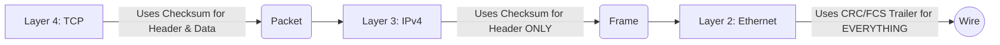

# Episode 3: Error Detection & Correction

## 📖 The Story: The Sealed Envelope
Imagine sending an important legal document through the mail. 
- **Error Detection** is putting a wax seal on the envelope. When the receiver gets it, they check the seal. If it's broken, they know the document was tampered with (corrupted), so they throw it in the trash and ask you to send a new one.
- **Error Correction** is like writing the document in three different languages. If a coffee stain ruins a paragraph in English, the reader can look at the Spanish version to figure out the missing words, fixing the error themselves without needing a resend.

## 🤿 Layer 1 Deep Dive: How we detect bit flips
As data travels across fiber optics (light) or copper (electricity), interference can flip a `1` to a `0`. We need mathematical ways to catch this.

1. **Parity Bit (The Simplest):** 
   - We count the number of `1`s in our data. 
   - *Even Parity:* If we have three `1`s (odd), we add an extra `1` at the end to make the total count even (four `1`s). 
   - *Flaw:* If *two* bits flip simultaneously, the parity stays even, and the error goes undetected!
2. **Checksum (Used in IP/TCP Headers):**
   - We slice the data into 16-bit words and add them all up. We take the sum, flip the bits (1s complement), and attach it to the packet.
   - The receiver does the exact same math. If their sum doesn't match the attached Checksum, the packet is corrupted and silently dropped.
3. **CRC - Cyclic Redundancy Check (Used in Ethernet Frames/Layer 2):**
   - The absolute gold standard for detection. It treats the data as a massive polynomial and divides it by a secret divisor key. The remainder of this division is the CRC value (FCS - Frame Check Sequence).
   - Highly resilient against burst errors (multiple bits flipping in a row).

### Visualizing the OSI Layer Error Checks

## 🤿 Layer 2 Deep Dive: Forward Error Correction (FEC)
Waiting for an ACK and retransmitting a dropped packet (TCP) takes too much time for real-time traffic like Voice over IP (VoIP) or Satellite communications. 
**FEC** sends redundant data *along with* the original payload. Mathematical algorithms (like Hamming Code or Reed-Solomon) allow the receiver to reconstruct dropped or corrupted bits on the fly without ever asking the sender for a retransmission. It consumes more bandwidth but drastically reduces latency.

## 🎙️ The Interview Answer (Memorize This)
**Interviewer:** *"Can you explain the difference between a Checksum and CRC, and where they are used?"*
**You:** *"Both are error detection mechanisms. Checksum is relatively simple—it involves summing up blocks of data. It's heavily used at Layers 3 and 4 for IP and TCP headers. CRC, or Cyclic Redundancy Check, uses complex polynomial division and is mathematically much stronger at detecting multi-bit burst errors. CRC is placed in the Frame Check Sequence (FCS) trailer of Layer 2 Ethernet frames to validate the entire frame before it is processed."*

## 🕵️ The Interrogation (Read, Answer, Analyze)

**Q1: You ping a server and get a response. However, you notice that IPv4 has a header checksum, but IPv6 completely removed its header checksum. Why would IPv6 remove such an important error check?**
- **Analysis/Answer:** Efficiency. IPv6 removed the checksum because error detection is already handled thoroughly at Layer 2 (Ethernet CRC) and Layer 4 (TCP/UDP Checksum). Doing checksum calculations at every single router hop for IPv4 wastes CPU cycles. IPv6 offloaded this to make routing faster.

**Q2: A video stream is using UDP. UDP has an optional checksum. If a UDP packet arrives with a bad checksum, what does the receiving OS do? Does it ask for a retransmission?**
- **Analysis/Answer:** It silently drops the packet. UDP is a connectionless, best-effort protocol. It has no mechanism for retransmission (no ACKs). The video application will just experience a brief visual glitch or artifact.

**Q3: What is a "Collision" in networking, and how does CRC relate to it?**
- **Analysis/Answer:** A collision happens in older half-duplex networks (like hubs) when two devices transmit electrical signals simultaneously, corrupting both signals. The receiving NIC will run the mathematical CRC check on the garbled data, realize the remainder doesn't match the FCS trailer, and discard the frame as a "runt" or "corrupted frame."
