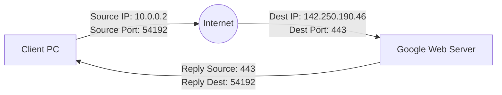

# Episode 4: Well-Known Ports & Services

## 📖 The Story: The High-Rise Hotel
Imagine a massive skyscraper hotel with 65,535 rooms (Ports). 
The hotel's street address is its **IP Address** (getting you to the building). 
But dropping a package in the lobby isn't enough; you must deliver it to the correct room.
- Rooms 1 to 1024 are "Well-Known" reserved rooms. The VIPs live here. Room 80 is *always* the Web Server. Room 22 is *always* the SSH security guard.
- Rooms 1025 to 65535 are "Ephemeral" (temporary) rooms. When you open a Chrome tab, your PC rents a random high-numbered room (like 54,321) to receive the webpage data back from the server.

## 🤿 Layer 1 Deep Dive: The VIP List (Memorize These)
You must know these cold.
- **20/21 (TCP) - FTP**: File Transfer Protocol. 21 is for control (commands), 20 is for actual data. (Unencrypted = bad).
- **22 (TCP) - SSH**: Secure Shell. Encrypted CLI access. Also used by SFTP (Secure FTP).
- **23 (TCP) - Telnet**: Unencrypted CLI access. Everything is in plaintext. Never use this.
- **25 (TCP) - SMTP**: Simple Mail Transfer Protocol. Used for *routing and sending* emails between mail servers.
- **53 (TCP/UDP) - DNS**: Domain Name System. Converts google.com to an IP. (UDP for fast queries, TCP for large zone transfers).
- **67/68 (UDP) - DHCP**: Dynamic Host Configuration Protocol. Assigns IP addresses automatically. (67 Server, 68 Client).
- **80 (TCP) - HTTP**: Hypertext Transfer Protocol. Unencrypted web traffic.
- **110 (TCP) - POP3**: Post Office Protocol. *Downloads* email to local device and deletes from server.
- **143 (TCP) - IMAP**: Internet Message Access Protocol. *Syncs* email across multiple devices.
- **443 (TCP) - HTTPS**: HTTP Secure. Encrypted web traffic (TLS/SSL).
- **3389 (TCP/UDP) - RDP**: Remote Desktop Protocol. Windows screen sharing.

### Visualizing a Socket Connection
An IP and a Port combined form a **Socket** (e.g., `192.168.1.5:443`).

## 🤿 Layer 2 Deep Dive: TCP vs UDP (Why do we choose one over the other?)
- **TCP (Transmission Control Protocol):** Connection-oriented. Does a 3-way handshake (SYN, SYN-ACK, ACK) before sending data. Guarantees delivery via ACKs. If dropped, it resends. Used for Web, Email, SSH, where *data integrity* is critical.
- **UDP (User Datagram Protocol):** Connectionless. "Fire and forget." No handshakes, no ACKs, no retransmissions. Used for DNS, DHCP, Voice, Video. Why? Because if a frame of a live video call drops, you don't want to pause the whole call to re-download it a second later—you just accept the glitch and keep going. *Speed* is critical.

## 🎙️ The Interview Answer (Memorize This)
**Interviewer:** *"Why does DNS use both TCP and UDP on port 53?"*
**You:** *"DNS primarily uses UDP for standard client queries because UDP is connectionless and fast, avoiding the overhead of the TCP 3-way handshake. However, DNS will switch to TCP over port 53 for two reasons: First, if the query response size exceeds 512 bytes (common with DNSSEC). Second, for Zone Transfers between primary and secondary DNS servers, where guaranteed, reliable delivery of large amounts of data is required."*

## 🕵️ The Interrogation (Read, Answer, Analyze)

**Q1: A user cannot access an internal web application via `http://10.10.10.50`, but they can ping the IP address successfully. What is the most likely issue?**
- **Analysis/Answer:** The IP is reachable, meaning Layers 1-3 (Physical, Data Link, Network) are working fine (Ping uses ICMP at L3). The issue is at Layer 4 (Transport) or above. The most likely cause is a firewall blocking TCP Port 80, or the web service (Apache/IIS) on the server is crashed/stopped. 

**Q2: You capture traffic using Wireshark and see clear-text passwords being transmitted. You notice the destination port is 21. What protocol is being used, and what should be used instead?**
- **Analysis/Answer:** Port 21 is FTP (File Transfer Protocol), which sends all credentials and data in plaintext. The secure alternative is SFTP (SSH File Transfer Protocol), which operates over TCP Port 22 and encrypts the entire session.

**Q3: DHCP uses ports 67 and 68 via UDP. Since a computer requesting an IP address doesn't *have* an IP address yet, how does it communicate with the server?**
- **Analysis/Answer:** It uses a Layer 2 and Layer 3 Broadcast. The source IP is `0.0.0.0` (I don't know who I am), and the destination IP is `255.255.255.255` (Broadcast to everyone). The destination MAC address is `FF:FF:FF:FF:FF:FF`. The switch floods this to all ports, and the DHCP server hears it and responds.
