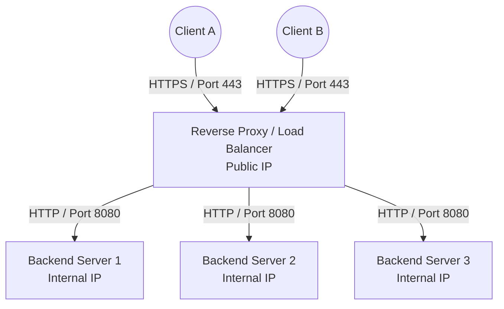

# Episode 5: Proxies & Load Balancing

## 📖 The Story: The Shopper and the Bouncer
- **Forward Proxy (The Personal Shopper):** You want to buy a restricted item, but you don't want the store to know *you* bought it. You hire a proxy. You tell the proxy, "Go get me this item." The proxy goes to the internet, buys it, and hands it back to you. The internet only sees the proxy. *Purpose: Protects the Client (internal users).*
- **Reverse Proxy (The Nightclub Bouncer):** The nightclub (Web Server) has VIPs inside that must be protected. You don't walk directly up to the DJ. You walk up to the bouncer at the front door. The bouncer checks your ID, decides which room you belong in, and fetches the drinks for you. You never talk to the actual server. *Purpose: Protects the Server (and provides load balancing).*

## 🤿 Layer 1 Deep Dive: Reverse Proxies & Load Balancing
Modern internet architectures don't expose Web Servers directly to the public internet. They sit behind a Reverse Proxy (like NGINX, HAProxy, or an F5 BIG-IP).

**Load Balancing Algorithms:**
If the Reverse Proxy has 3 backend Web Servers, how does it choose where to send your traffic?
1. **Round Robin:** Sequential order. Server A, then B, then C, then A. Simple, but assumes all servers are equally powerful and all requests are equal in size.
2. **Least Connections:** The load balancer keeps track of active TCP sessions. It sends the new request to the server with the fewest active connections. Great for long-lived sessions.
3. **IP Hash (Sticky Sessions):** The load balancer hashes the Client's IP address. This guarantees that Client X will *always* be routed to Server B. Required for apps that store local session state (like a shopping cart stored in server RAM).

### Visualizing a Reverse Proxy Flow

*Notice how the Load Balancer terminates the secure HTTPS connection (SSL Offloading) and forwards unencrypted HTTP traffic to the backend, saving backend CPU cycles!*

## 🤿 Layer 2 Deep Dive: L4 vs L7 Load Balancing
- **Layer 4 Load Balancing (Transport):** The load balancer looks *only* at the IP address and TCP/UDP Port. It doesn't inspect the data payload. It's incredibly fast but "dumb." 
- **Layer 7 Load Balancing (Application):** The load balancer decrypts the traffic and reads the HTTP headers, URLs, and cookies. It is "smart." It can say, "Ah, the URL is `/images/logo.png`. I will route this specifically to the Image Server cluster instead of the main Application servers."

## 🎙️ The Interview Answer (Memorize This)
**Interviewer:** *"Can you explain the difference between a Forward Proxy and a Reverse Proxy?"*
**You:** *"A Forward Proxy sits in front of client endpoints and intercepts outbound traffic to the internet. It is typically used by corporations for content filtering, caching, and masking internal IP addresses. A Reverse Proxy sits in front of backend servers and intercepts inbound traffic from the internet. It protects the servers, performs SSL offloading, and usually acts as a Layer 7 load balancer to distribute traffic across a server farm."*

## 🕵️ The Interrogation (Read, Answer, Analyze)

**Q1: A company implements a Round Robin load balancer across 3 web servers. Users are complaining that they keep getting logged out randomly while navigating the site. What is happening and how do you fix it?**
- **Analysis/Answer:** The application is likely storing user session state (like login tokens) locally in the memory of individual web servers. Because Round Robin cycles requests sequentially, the user's first request (login) hits Server A, but their second request (clicking a link) hits Server B, which doesn't have their login token. The fix is to configure the load balancer for **Sticky Sessions (Session Persistence)**, ensuring a user is consistently routed to the same server.

**Q2: We need to route web traffic based on the language preference in the user's HTTP header (e.g., `Accept-Language: fr-FR`). Can we use a Layer 4 Load Balancer for this?**
- **Analysis/Answer:** No. Layer 4 load balancing operates at the Transport layer (TCP/UDP) and can only make routing decisions based on IP addresses and ports. To inspect HTTP headers, you must use a **Layer 7 Load Balancer**, which operates at the Application layer and can read the internal payload of the HTTP request.

**Q3: What is "SSL Offloading" (or SSL Termination) at a Reverse Proxy, and why is it beneficial?**
- **Analysis/Answer:** SSL Offloading means the Reverse Proxy holds the SSL certificate and performs the heavy cryptographic math to decrypt the inbound HTTPS traffic. It then forwards the traffic as plain HTTP to the internal backend servers. This is beneficial because asymmetric encryption (TLS handshakes) is highly CPU-intensive. Offloading it frees up the backend web servers to focus entirely on application logic and database queries.
