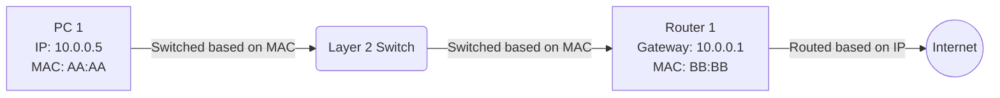

# Episode 6: Network Fundamentals & Physical Layer

## 📖 The Story: Walkie-Talkies vs Cell Phones
- **Half-Duplex (The Walkie-Talkie):** You press the button to speak. While you speak, you cannot listen. If both people press the button at the same time, the signal turns into static (a Collision). Old Ethernet hubs and all Wi-Fi networks are Half-Duplex.
- **Full-Duplex (The Cell Phone):** You can talk and listen at the exact same time on separate channels. No collisions. Modern Ethernet switches operate in Full-Duplex.

## 🤿 Layer 1 Deep Dive: Wi-Fi Standards (802.11)
Wi-Fi uses radio frequencies (2.4 GHz and 5 GHz) and is inherently a shared, half-duplex medium. It uses **CSMA/CA (Carrier Sense Multiple Access with Collision Avoidance)**. Before transmitting, a device literally "listens" to the airwaves. If it hears another device talking, it backs off and waits.
- **802.11a/b/g:** The legacy stuff (up to 54 Mbps). 
- **802.11n (Wi-Fi 4):** Introduced **MIMO** (Multiple Input, Multiple Output). Instead of one antenna, devices use multiple antennas to send multiple data streams simultaneously.
- **802.11ac (Wi-Fi 5):** Pushed into the 5 GHz band exclusively for wider channels and Gigabit speeds. Introduced *Wave 2 MU-MIMO* (Multi-User MIMO), allowing the router to talk to 4 different devices at the exact same time.
- **802.11ax (Wi-Fi 6/6E):** The modern era. Introduced **OFDMA** (Orthogonal Frequency-Division Multiple Access). Instead of sending one large truck of data to one person, it chops the truck into smaller compartments and delivers data to multiple people in a single transmission. Extremely efficient in crowded areas (like stadiums).

## 🤿 Layer 2 Deep Dive: MAC vs IP & Traffic Types
- **MAC Address (Physical / Layer 2):** A 48-bit hex address burned into your Network Interface Card (NIC) by the manufacturer. It *never* changes. It is used to get data from one device to the *very next* device on the same local network segment (Switch).
- **IP Address (Logical / Layer 3):** A 32-bit (IPv4) address assigned by a network admin or DHCP. It changes depending on what network you are on. It is used for end-to-end routing across the globe (Routers).

**Traffic Types:**
1. **Unicast:** One-to-One. (Watching a YouTube video).
2. **Broadcast:** One-to-All. (A DHCP Discover packet shouting to every PC on the subnet).
3. **Multicast:** One-to-Many. (A live corporate CEO stream. Only PCs that "subscribe" to the multicast group receive the video, saving massive bandwidth).

### Visualizing MAC vs IP Delivery

*Notice how the Switch only cares about the MAC address to move the frame locally. The Router looks at the IP to move the packet globally.*

## 🎙️ The Interview Answer (Memorize This)
**Interviewer:** *"Can you explain the difference between a MAC address and an IP address? Why do we need both?"*
**You:** *"A MAC address is a physical, burned-in Layer 2 address used for local delivery on the same network segment. An IP address is a logical, hierarchical Layer 3 address used for end-to-end routing across different networks. We need both because the IP address tells us the final destination, like the address on an envelope, while the MAC address gets the packet to the very next hop—like handing the envelope from the mailman to the local post office."*

## 🕵️ The Interrogation (Read, Answer, Analyze)

**Q1: Two PCs are connected to the exact same Layer 2 switch. PC-A wants to send a file to PC-B. Does PC-A use PC-B's IP address or MAC address to send the file?**
- **Analysis/Answer:** PC-A uses *both*. The application generates an IP packet with PC-B's IP address as the destination. However, to physically put it on the wire, PC-A encapsulates that IP packet into an Ethernet frame using PC-B's MAC address as the destination. (It uses ARP to find the MAC). The switch then forwards the frame based *only* on the MAC address.

**Q2: Why is 5 GHz Wi-Fi generally faster but has worse range than 2.4 GHz?**
- **Analysis/Answer:** Physics. Lower frequencies (2.4 GHz) have longer wavelengths, which are better at penetrating solid objects like walls and traveling long distances. Higher frequencies (5 GHz) have shorter wavelengths that attenuate (lose strength) rapidly through obstacles, but they can carry significantly more data per second (wider channels).

**Q3: In a Star topology, all devices connect to a central switch. If that switch fails, the whole network goes down. Why don't we just use a Full Mesh topology where every device is directly connected to every other device?**
- **Analysis/Answer:** Cost and scalability. A Full Mesh requires `n(n-1)/2` physical cables. For 5 computers, that's 10 cables. For 100 computers, that's 4,950 cables. It is physically and financially impossible to implement at scale. Instead, we use a Star (or Extended Star) topology and add redundancy to the central switches.
