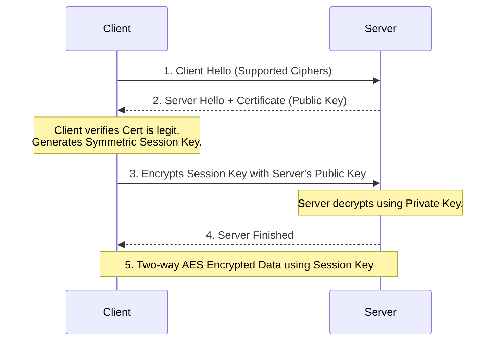

# Episode 7: Security & Encryption Deep Dive

## 📖 The Story: Spies and Lockboxes
Imagine two spies, Alice and Bob, who want to exchange a secret map via mail. 
- **Symmetric Encryption (The Single Key):** Alice puts the map in a lockbox, locks it with Key X, and mails it. But Bob needs Key X to open it! How does she send Key X securely? If she mails it, the enemy can intercept it.
- **Asymmetric Encryption (Public/Private Keys):** Everyone in the world has a Public Padlock, but only they have the Private Key to open it. Alice takes Bob's Public Padlock (which is public knowledge), locks the box with it, and mails it. Now, *only Bob* can open the box with his Private Key. Even Alice can't reopen it once it's locked!

## 🤿 Layer 1 Deep Dive: The TLS/SSL Handshake
When you visit `https://amazon.com`, your browser and Amazon's server perform a brilliant dance combining both methods. Why both? Because Asymmetric math is incredibly slow (CPU heavy), while Symmetric math is blazingly fast.

**The Handshake (Simplified):**
1. **Hello:** Client says, "I want to talk securely. Here are the ciphers I support."
2. **Certificate:** Server replies, "Here is my Public Key (inside an X.509 Certificate signed by a trusted Authority like DigiCert)."
3. **Key Exchange (Asymmetric):** The Client generates a *brand new, random Symmetric Session Key*. The Client encrypts this new Session Key using Amazon's *Public Key* and sends it to Amazon.
4. **Decryption:** Amazon uses its *Private Key* to decrypt the message and retrieve the Session Key.
5. **Secure Traffic (Symmetric):** Now, both the Client and Amazon have the same Symmetric Session Key. All future web traffic is encrypted incredibly fast using this single shared key (AES).

### Visualizing the Handshake

## 🤿 Layer 2 Deep Dive: Common Network Attacks
- **DDoS (Distributed Denial of Service):** A botnet of 100,000 infected PCs all send TCP SYN packets to a server simultaneously. The server opens half-connections for all of them, exhausting its RAM, and crashes.
- **MITM (Man In The Middle):** An attacker intercepts communication between two parties. They pretend to be the server to the client, and pretend to be the client to the server, reading all plaintext data in between.
- **ARP Spoofing (Poisoning):** A localized MITM attack. The attacker constantly broadcasts ARP replies on the local switch saying, "Hey everyone, my MAC address belongs to the Default Gateway's IP!" The switch updates its MAC table, and all PCs start sending their internet traffic to the attacker's PC instead of the real router.

## 🎙️ The Interview Answer (Memorize This)
**Interviewer:** *"Can you explain how Symmetric and Asymmetric encryption work together in a TLS handshake?"*
**You:** *"Absolutely. Asymmetric encryption uses a public and private key pair, which is highly secure for key exchange but too computationally heavy for bulk data transfer. Symmetric encryption uses a single shared key and is extremely fast. In a TLS handshake, the client uses the server's Asymmetric Public Key to securely encrypt and transmit a brand new Symmetric Session Key. Once the server decrypts it, both parties use that Symmetric key for fast, secure data transfer for the rest of the session."*

## 🕵️ The Interrogation (Read, Answer, Analyze)

**Q1: You visit a website and your browser throws a massive red warning: "ERR_CERT_DATE_INVALID". What exactly has happened, and is the connection still encrypted?**
- **Analysis/Answer:** The X.509 SSL Certificate presented by the web server has expired. The math for encryption (TLS) will still technically work, and the traffic will be encrypted. However, the browser is warning you that the *identity* of the server can no longer be cryptographically trusted by a Certificate Authority.

**Q2: A network is experiencing a massive DDoS attack using ICMP floods (Pings). You decide to block all ICMP traffic at the edge firewall. The DDoS stops, but suddenly users complain that some large websites are failing to load, or they are getting 'fragmentation' errors. Why?**
- **Analysis/Answer:** You broke PMTUD (Path MTU Discovery). When a router needs to fragment a packet but the "Don't Fragment" bit is set, it drops the packet and sends an **ICMP "Destination Unreachable / Fragmentation Needed"** message back to the sender so they can adjust their MTU size. By blocking *all* ICMP, the sender never gets this message, resulting in silent packet drops (a Black Hole). You should only block ICMP Echo Requests, not all ICMP types.

**Q3: How does a Digital Signature prove that a file hasn't been tampered with?**
- **Analysis/Answer:** The sender runs the file through a hashing algorithm (like SHA-256) to create a unique hash value. The sender then encrypts that hash with their **Private Key**. This is the Digital Signature. The receiver decrypts the signature using the sender's **Public Key** to reveal the hash. The receiver then hashes the file themselves. If the two hashes match, it proves two things: the file wasn't tampered with (Integrity), and it definitely came from the sender (Non-repudiation).
