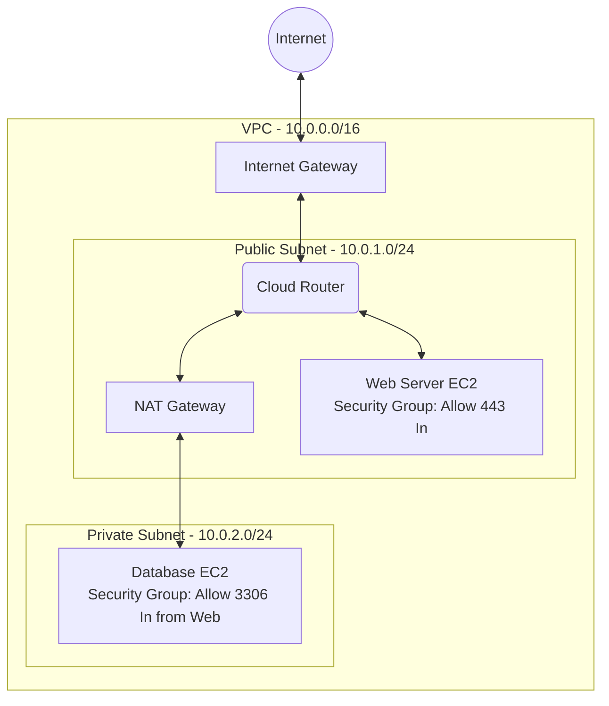

# Episode 9: Cloud Networking & Modern Infra

## 📖 The Story: Renting the Apartment Building
- On-Premise networking is like building a house from scratch. You buy the land (Datacenter), pour the concrete, and run the plumbing (Cables, Physical Switches). It takes months.
- **Cloud Networking (VPC)** is like renting an empty apartment building. The plumbing is already in the walls. You just go into a web dashboard and say, "I want Floor 1 to be public (Public Subnet) and Floor 2 to be locked down for VIPs (Private Subnet)." It's fully software-defined and deploys in seconds.

## 🤿 Layer 1 Deep Dive: VPCs, Subnets, and Gateways
When building in AWS or Azure, you create a **VPC (Virtual Private Cloud)**. This is your logically isolated slice of the cloud.
- **Public Subnet:** Has a direct route to an **Internet Gateway (IGW)**. Web servers live here. They have Public IP addresses.
- **Private Subnet:** Has NO direct route to the internet. Databases live here. To download an update, a Private Subnet server must route its traffic through a **NAT Gateway** sitting in the Public Subnet.

**Security at Two Layers:**
1. **Security Groups (SGs):** Operate at the *Instance/VM Level*. They are **Stateful**. If you write an inbound rule allowing Port 443 in, the SG automatically remembers the connection and allows the return traffic out.
2. **NACLs (Network Access Control Lists):** Operate at the *Subnet Level*. They are **Stateless**. If you allow Port 443 in, you *must* explicitly write an outbound rule allowing ephemeral ports (1024-65535) back out, otherwise the traffic drops.

### Visualizing Cloud Architecture

## 🤿 Layer 2 Deep Dive: SDN & QoS
- **SDN (Software-Defined Networking):** Traditional routers have both the "Control Plane" (the brain doing OSPF/BGP) and the "Data Plane" (the hardware forwarding packets) stuck in the same box. SDN decouples them. A central SDN Controller handles all the brains (Control Plane), and pushes forwarding rules down to "dumb" switches (Data Plane). 
- **QoS (Quality of Service):** Not all packets are created equal. An email delayed by 100ms is fine. A VoIP call delayed by 100ms is a disaster. QoS marks packets using the **DSCP (Differentiated Services Code Point)** field in the IP header. Routers read this mark and put VoIP packets in a high-priority "Expedited Forwarding" queue, pushing them out before regular data packets.

## 🎙️ The Interview Answer (Memorize This)
**Interviewer:** *"Can you explain the difference between a Security Group and a NACL in cloud networking?"*
**You:** *"Security Groups act as virtual firewalls at the instance or VM level, and they are stateful, meaning if you allow inbound traffic, the return outbound traffic is automatically allowed. NACLs, on the other hand, act as firewalls at the subnet level and are stateless, meaning you must explicitly define both inbound and outbound rules for traffic to flow successfully."*

## 🕵️ The Interrogation (Read, Answer, Analyze)

**Q1: A database in a private subnet needs to pull a software update from `ubuntu.com`. It has no public IP. How exactly does the traffic get out and back in?**
- **Analysis/Answer:** The database sends the traffic to the **NAT Gateway** (located in the public subnet). The NAT Gateway replaces the database's private IP with its own Public IP (Source NAT) and forwards it to the internet. When `ubuntu.com` replies, it hits the NAT Gateway, which checks its translation table, translates the destination IP back to the database's private IP, and forwards it to the private subnet.

**Q2: You apply a QoS policy on a router to prioritize VoIP traffic. However, during heavy congestion, users still report choppy audio. What is the most likely reason the router is ignoring your QoS markings?**
- **Analysis/Answer:** The QoS policy is likely applied to the *inbound* interface instead of the *outbound* interface. QoS queuing algorithms only trigger when a router's hardware buffer is congested as it is trying to push packets *out* onto a wire. You cannot control the rate at which packets arrive at the router, you can only control the order in which they leave.

**Q3: What is the main advantage of SDN separating the Control Plane from the Data Plane?**
- **Analysis/Answer:** Centralized management and automation. Instead of logging into 500 individual switches to configure VLANs and routing protocols, you log into one centralized SDN Controller via API. The controller calculates the best paths for the entire network simultaneously and pushes the flow tables down to all 500 switches instantly.
