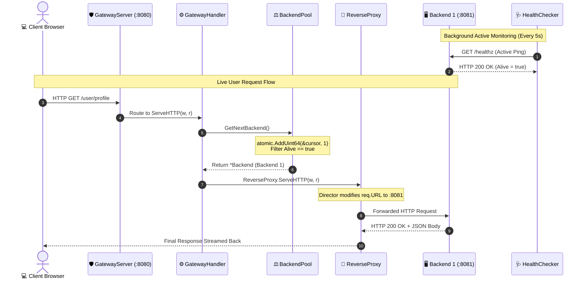

# 01. End-to-End System Architecture (HLD & LLD)

```
========================================================================================
                                 COMPLETE SYSTEM BLUEPRINT
========================================================================================

                 [ 📱 Mobile App / 💻 Web Browser (Client) ]
                                    │
                                    │  1. HTTP GET /api/data (Port :8080)
                                    ▼
       ┌─────────────────────────────────────────────────────────────┐
       │             🛡️ GOGATEWAY PROCESS (:8080)                   │
       │                                                             │
       │   ┌─────────────────────────────────────────────────────┐   │
       │   │  server.GatewayServer (Orchestrator Lifecycle)      │   │
       │   │  - ListenAndServe(":8080")                          │   │
       │   │  - Graceful Shutdown Channel (os.Interrupt)         │   │
       │   └──────────────────────────┬──────────────────────────┘   │
       │                              │                              │
       │                              ▼                              │
       │   ┌─────────────────────────────────────────────────────┐   │
       │   │  proxy.GatewayHandler (HTTP Entrypoint)             │   │
       │   │  - ServeHTTP(w, r)                                  │   │
       │   └──────────────────────────┬──────────────────────────┘   │
       │                              │                              │
       │             2. pool.GetNextBackend()                        │
       │                              │                              │
       │   ┌──────────────────────────▼──────────────────────────┐   │
       │   │  loadbalancer.BackendPool                           │   │
       │   │  - sync.RWMutex (Protects slice of *Backend)        │   │
       │   │  - atomic.AddUint64(&cursor, 1) (Lock-free modulo)  │   │
       │   └───────────────┬─────────────────────┬───────────────┘   │
       │                   │                     │                   │
       │    3. Selected    │                     │ Health Updates    │
       │       *Backend    ▼                     ▲ (Active)          │
       │   ┌──────────────────────────┐   ┌──────┴───────────────┐   │
       │   │ httputil.ReverseProxy    │   │ health.HealthChecker │   │
       │   │ - Director (Rewrites URL)│   │ - time.Ticker (5s)   │   │
       │   │ - ErrorHandler (Closure) │   │ - Probe /healthz     │   │
       │   └───────────────┬──────────┘   └──────────────────────┘   │
       │                   │                                         │
       └───────────────────┼─────────────────────────────────────────┘
                           │ 4. Proxied TCP Connection
                           │
             ┌─────────────┼─────────────┐
             ▼             ▼             ▼
      ┌─────────────┐┌─────────────┐┌─────────────┐
      │  Backend 1  ││  Backend 2  ││  Backend 3  │
      │   (:8081)   ││   (:8082)   ││   (:8083)   │
      │  [HEALTHY]  ││  [HEALTHY]  ││   [DEAD]    │
      └─────────────┘└─────────────┘└─────────────┘
```

---

## 🔄 Live Interactive Flow (Step-by-Step)



---

## 🧩 Struct and Component Mapping

```
┌─────────────────────────────────────────────────────────────────────────────┐
│ 1. config.Config        : Holds CLI flags (GatewayAddr, Backends, Timeouts) │
│ 2. backend.Simulated    : Runs mock HTTP servers on :8081, :8082, :8083     │
│ 3. loadbalancer.Backend : Holds URL, Alive (bool), sync.RWMutex, ReverseProxy│
│ 4. loadbalancer.Pool    : Holds []*Backend, cursor (uint64), sync.RWMutex   │
│ 5. proxy.NewProxy       : Wraps httputil.ReverseProxy + ErrorHandler closure│
│ 6. health.HealthChecker : Ticker loop checking /healthz every N seconds     │
│ 7. server.GatewayServer : Manages http.Server & Graceful OS signal trap     │
└─────────────────────────────────────────────────────────────────────────────┘
```
