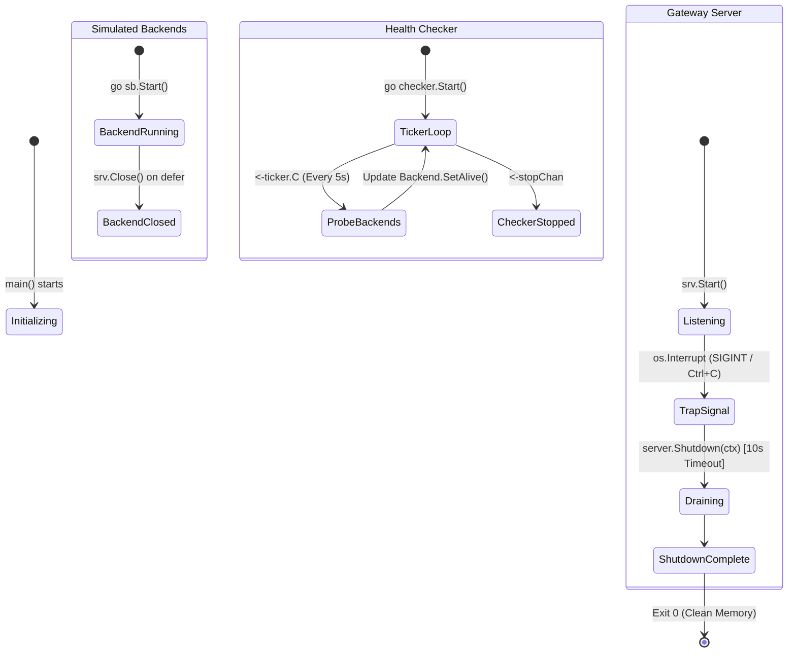

# 02. Concurrency, Goroutines & Runtime Execution Flow

```
========================================================================================
                          GOROUTINES & CONCURRENCY MAP
========================================================================================

                 [ OS Process: GoGateway (PID 12450) ]
                                   │
               ┌───────────────────┴───────────────────┐
               ▼                                       ▼
    ┌────────────────────────┐              ┌────────────────────────┐
    │  GOROUTINE 1: main()   │              │  Go Runtime Scheduler  │
    │  (Coordinator Thread)  │              │  (GMP Model: 8 Cores)  │
    └──────────┬─────────────┘              └────────────────────────┘
               │
               │  go sb.Start() (Spawns N backends)
               ├──────────────────────────────────────────────┐
               │                                              │
               ▼                                              ▼
    ┌────────────────────────┐                     ┌────────────────────────┐
    │ GOROUTINE 2: :8081     │                     │ GOROUTINE 3: :8082     │
    │ SimulatedBackend 1     │                     │ SimulatedBackend 2     │
    └────────────────────────┘                     └────────────────────────┘
               │
               │  go checker.Start()
               ├──────────────────────────────────────────────┐
               │                                              │
               ▼                                              ▼
    ┌────────────────────────┐                     ┌────────────────────────┐
    │ GOROUTINE 4: Health    │                     │ GOROUTINE 5: Server    │
    │ time.Ticker Loop (5s)  │                     │ http.ListenAndServe()  │
    └──────────┬─────────────┘                     └──────────┬─────────────┘
               │                                              │
               │  Spawns per probe                            │  Spawns per incoming HTTP req
               ▼                                              ▼
    ┌────────────────────────┐                     ┌────────────────────────┐
    │ GOROUTINE 6..N: Probe  │                     │ GOROUTINE N+1: Worker  │
    │ Worker (GET /healthz)  │                     │ ServeHTTP(w, r)        │
    └────────────────────────┘                     └────────────────────────┘
```

---

## 🚦 Goroutine Lifecycle & Graceful Shutdown Diagram



---

## ⚡ The Go GMP Runtime Model (Why It Beats C++ Threads)

```
+-----------------------------------------------------------------------------+
| G (Goroutines)  : 100,000+ lightweight user-space threads (~2KB stack)      |
| P (Processors)  : GOMAXPROCS logical execution contexts (matches CPU cores) |
| M (Machines)    : Actual OS kernel threads managed by Linux / Windows kernel|
+-----------------------------------------------------------------------------+

   [ G1 ] [ G2 ] [ G3 ] [ G4 ] [ G5 ]  <--- Local Run Queue
            │
            ▼
        ┌───────┐
        │   P   │  (Logical Processor)
        └───┬───┘
            ▼
        ┌───────┐
        │   M   │  (OS Kernel Thread) ──► [ Hardware CPU Core 0 ]
        └───────┘

💡 Work Stealing: When P1 has no Goroutines left, it steals 50% of Gs from P2!
```
