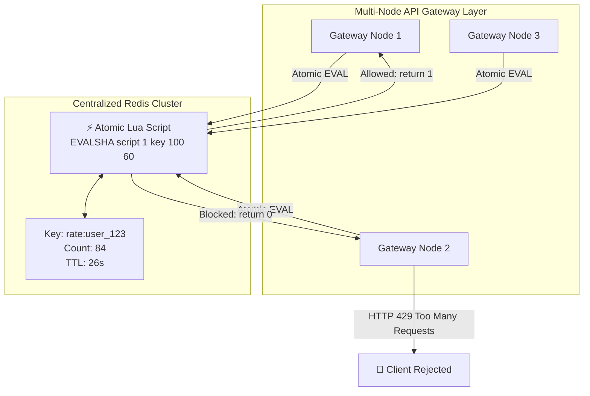

# 05. Rate Limiting Algorithms & Distributed Architecture

```
========================================================================================
                          5 RATE LIMITER ALGORITHMS COMPARED
========================================================================================

1. TOKEN BUCKET (Bursts Allowed, Lazy Refill)
   Refill Rate: 5 tokens/sec
   ┌───────────────────────┐
   │ 🪙  🪙  🪙  🪙  🪙    │  Capacity: 10
   │ 🪙  🪙  🪙            │
   └───────────┬───────────┘
               │ 1 token consumed per request
               ▼
   [ Passed: HTTP 200 OK ]   (Empty? -> [ Rejected: HTTP 429 ])


2. LEAKY BUCKET (Constant Output Rate / Traffic Shaping)
   Bursty Inflow: 100 reqs/sec
               ▼
   ┌───────────────────────┐
   │ 💧 💧 💧 💧 💧 💧 💧  │  FIFO Queue Buffer (Capacity 50)
   │ 💧 💧 💧              │  (Overflow drops immediately)
   └───────────┬───────────┘
               │ Constant leak: 5 reqs/sec
               ▼
   [ Steady Stream to Backend ]


3. FIXED WINDOW (Has 2x Boundary Spike Bug)
   Window 1 (1:00-1:01): [ 100 requests at 1:00:59 ] -> PASS
   Window 2 (1:01-1:02): [ 100 requests at 1:01:01 ] -> PASS
   ❌ 200 requests passed in a 2-second interval!


4. SLIDING WINDOW LOG (Exact, Memory Heavy)
   User Sorted Set: [ 1700000001, 1700000003, 1700000012, 1700000059 ]
   Step 1: Delete all entries < (now - 60s)
   Step 2: Check count of remaining timestamps
   Step 3: If count < Limit, add current timestamp


5. SLIDING WINDOW COUNTER (Hybrid Standard: 2 Integers, <0.05% Error)
   [ Previous Window: 80 reqs ]  |  [ Current Window (30% elapsed): 30 reqs ]
   
   Estimated = 30 + (80 * (1.0 - 0.30)) = 30 + 56 = 86 reqs in sliding 60s.
```

---

## 🌐 Distributed Rate Limiting with Redis & Lua Script


